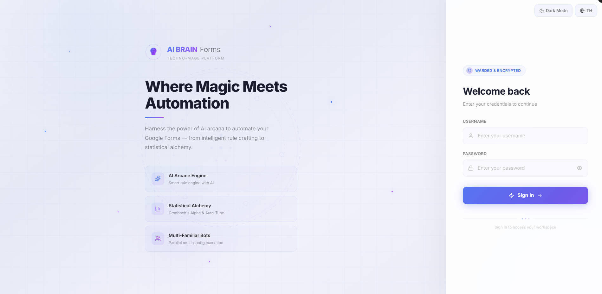
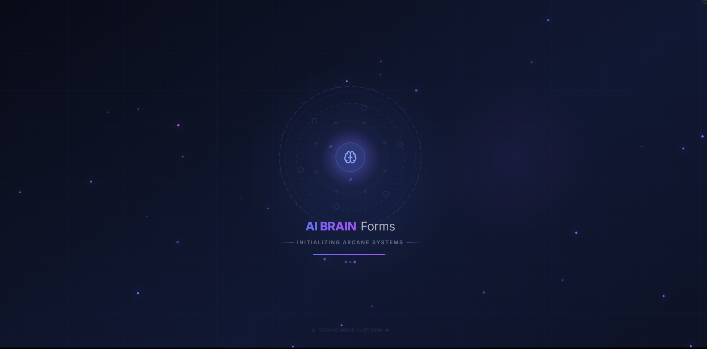
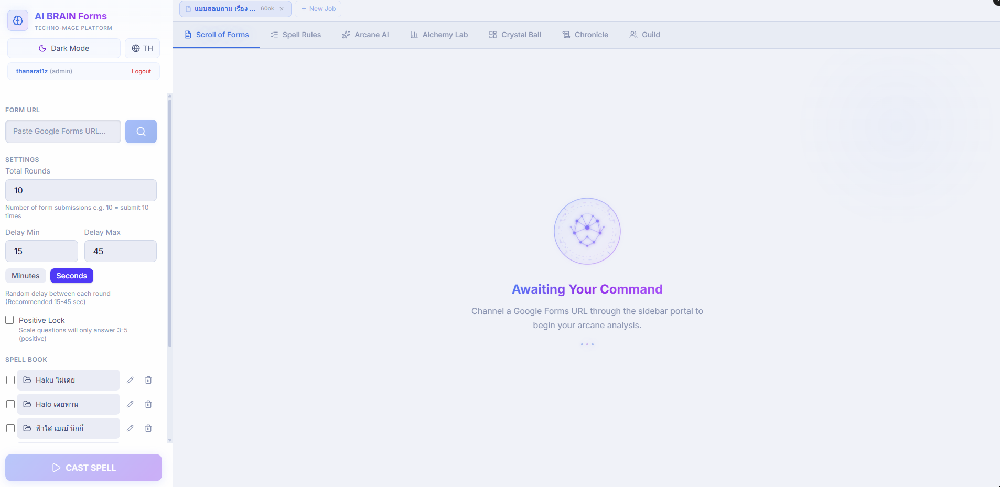
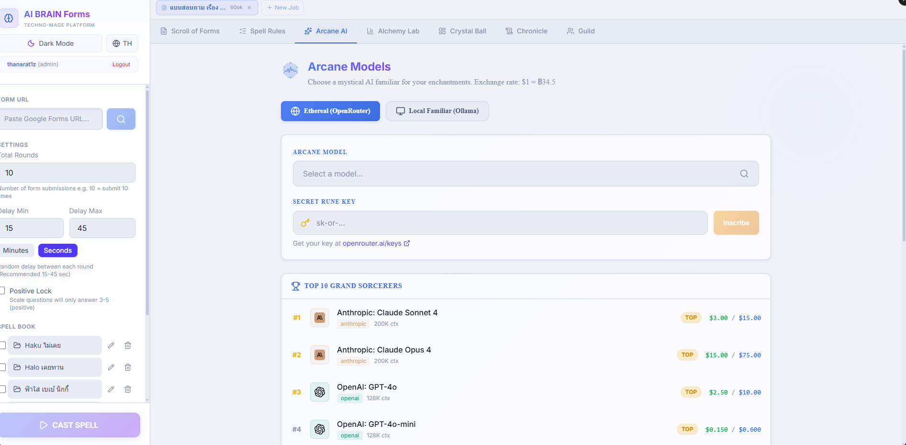

<div align="center">

# 🧠 AI BRAIN Forms

**Automated Google Forms Intelligence System**


> ⚠️ **Private Project** — Source code is not publicly available.
> This repository is for showcase purposes only.

</div>

---

## Overview

AI BRAIN Forms is an AI-powered system designed to automate Google Forms submissions using a Large Language Model (LLM). It generates realistic, context-aware answers for each question, supports complex conditional branching, and can run up to **10 independent jobs simultaneously**.

---

## Screenshots

### Login Page


### Splash Screen


### Dashboard


### Arcane AI — Model Selection


---

## Key Features

### 🤖 AI-Powered Answer Engine
Uses an LLM to analyze each question and generate contextually appropriate answers. Supports multiple question types: Multiple Choice, Checkbox, Short Answer, Paragraph, Linear Scale, Dropdown, and Date/Time.

### ⚡ Multi-Job System
Run up to **10 jobs in parallel**, each with its own form configuration, status tracking, logs, and results. Switch between jobs and monitor progress in real time.

### 🔀 Conditional Branching Support
Handles forms with skip logic and page-based branching. Tracks page history accurately to prevent submission errors caused by mismatched form pages.

### 🎭 Multi-Profile / Persona Mode
Define multiple answer personas and rotate them across submission rounds, producing diverse and natural-looking responses.

### 📋 Rule Editor
Customize how each question is answered:
- **Fixed Values** — Pin specific answers or randomly pick from selected options
- **Keyword Weights** — Bias answers toward a desired direction
- **Skip Trigger** — Force a specific answer then immediately end the form

### 📊 Cronbach's Alpha Analysis
After a run completes, analyze the internal consistency of the answer set to verify data quality.

### 💾 Config Save / Load
Save rule configurations per form and reload them anytime — no need to reconfigure from scratch.

### 👥 User Management
Built-in login system with role-based access, supporting multiple users on a shared server.

---

## Tech Stack

| Category | Technologies |
|----------|-------------|
| **Frontend** | Next.js 16, React, TypeScript, TailwindCSS |
| **Backend** | Python 3.12, FastAPI, Threading |
| **AI / LLM** | LLM API Integration (OpenRouter / Ollama) |
| **Infrastructure** | Docker, Docker Compose |
| **Communication** | REST API, Server-Sent Events (real-time streaming) |

---

## System Architecture

```
┌─────────────────────────────────────────┐
│           Next.js Frontend              │
│  (Dashboard · Rule Editor · Job Bar)    │
└──────────────────┬──────────────────────┘
                   │ REST API
┌──────────────────▼──────────────────────┐
│           FastAPI Backend               │
│  ┌─────────────────────────────────┐   │
│  │         Job Manager             │   │
│  │  Job 1 │ Job 2 │ ... │ Job 10   │   │
│  └────┬────────────────────────────┘   │
│       │                                 │
│  ┌────▼──────────┐  ┌───────────────┐  │
│  │ Answer Engine │  │ Form Submitter│  │
│  │   (LLM API)   │  │(Google Forms) │  │
│  └───────────────┘  └───────────────┘  │
└─────────────────────────────────────────┘
```

---

## UI Design

The interface follows a **Techno-Mage** design theme — a dark Indigo-Navy palette with Arcane Blue and Mystic Violet accents, giving the system a distinctive high-tech aesthetic.

- Dark / Light mode toggle
- Thai / English language support (i18n)
- Animated spell-circle splash screen on login
- Real-time log streaming during job execution
- Job status bar with live progress indicators per job

---

## Deployment

Deployed via Docker Compose. Designed for self-hosted environments including:
- Raspberry Pi / Home Server
- NAS devices
- Any Linux-based server on a local network

---

<div align="center">

**Developed by Thanarat C.**
*Private Project — All Rights Reserved*

</div>
